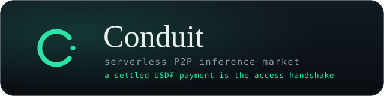

<p align="center">
  
</p>

<p align="center">
  <b>A serverless, peer-to-peer marketplace for AI inference — where a settled USD₮ payment is the access handshake.</b>
</p>

<p align="center">
  <a href="./LICENSE"></a>
  
  
  
  <a href="https://www.conduitt.xyz"></a>
</p>

---

A peer with a GPU sells LLM inference over an end-to-end-encrypted Holepunch link; a buyer's agent pays
per inference in USD₮, wallet-to-wallet, with **no platform in the middle**. No payment → no handshake →
the model is never reached. Model weights never move; only prompt-bytes-in / token-bytes-out cross the
wire; **the cloud sees nothing**. Every model runs fully on-device through the **QVAC runtime**.

> **Testnet only.** Payments use test USD₮ on Ethereum Sepolia — no real money moves. This is a
> demonstration of the access-control + settlement primitive, not a live financial service.

**Live:** [conduitt.xyz](https://www.conduitt.xyz) · **Pitch:** [conduitt.xyz/pitch](https://www.conduitt.xyz/pitch)

## Contents

- [How it works](#how-it-works)
- [Demo hardware](#demo-hardware)
- [Prerequisites](#prerequisites)
- [Setup (clean checkout)](#setup-clean-checkout)
- [Environment variables](#environment-variables)
- [Contract addresses (Sepolia)](#contract-addresses-sepolia)
- [Getting testnet funds](#getting-testnet-funds)
- [Running it](#running-it)
- [All commands](#all-commands)
- [Models](#models)
- [Audit log](#audit-log)
- [Remote APIs — the no-cloud guarantee](#remote-apis--the-no-cloud-guarantee)
- [Reproducing the demo](#reproducing-the-demo)
- [Repository layout](#repository-layout)
- [License](#license)

---

## How it works

One app is both **buyer** and **seller** — the role is a runtime choice, not a separate product. A node
learns what it can sell by benchmarking its own hardware (the **capability prober**, `npm run bench`).

The buyer→answer path has four hops:

1. **Discover** — peers meet on a Hyperswarm/Holepunch DHT (topic `conduit:market:v1`) with NAT
   hole-punching. There is no server in the middle. The seller advertises an offer (model + price + tps).
2. **Route** — an on-device **confidence router** samples a small local model *k* times and measures
   self-consistency (QVAC exposes no logprobs, so we use answer stability). Easy/consistent prompts are
   answered **free, locally**; only hard/ambiguous ones **escalate** to a paid peer.
3. **Pay** — escalation opens an **escrow payment channel** (one on-chain deposit), then settles each
   answer **off-chain** with a signed **EIP-712 voucher** — answers come back in ~2s with no on-chain
   wait. (A simpler per-inference on-chain payment path also exists.) A **SpendPolicy** (per-call cap +
   session budget) authorizes the spend; if it declines, the buyer keeps the free local draft.
4. **Run** — the payment releases the seller's **firewall-gated QVAC provider** pubkey; the buyer
   delegates inference to it over the E2E link. The model executes **on the seller's device** — the
   buyer never sees the weights, the seller never sees the buyer's keys, and no prompt touches a cloud.

A **freeloader** (no payment) is refused at the Noise handshake having transferred **0 bytes**. First-party
**reputation** (served/failed + EWMA tok/s) ranks sellers in the marketplace.

For deeper architecture notes see [`docs/CONDUIT-ARCHITECTURE.md`](./docs/CONDUIT-ARCHITECTURE.md) and the
diagrams in [`docs/diagrams/`](./docs/diagrams/).

---

## Demo hardware

The demo runs across **two physical machines** on independent networks (a third "freeloader" role is a
separate process + keypair on the buyer machine, not a third device). Both machines run the same `conduit`
codebase; buyer/seller is a runtime flag.

| Role | Machine | CPU | GPU | RAM | Storage | OS |
|------|---------|-----|-----|-----|---------|-----|
| **Buyer** (router + agent + wallet) | Linux laptop | AMD Ryzen 7 7435HS — 8 cores / 16 threads | NVIDIA GeForce RTX 4050 Laptop — 6 GB VRAM, Vulkan, driver 580.82 | 24 GB DDR5 | NVMe SSD (~10 GB free for the model cache) | Pop!_OS 24.04 LTS, kernel 6.16 |
| **Seller** (GPU provider) | MacBook Air (M5) | Apple M5 — Apple Silicon | Apple integrated GPU (Metal) | 16 GB unified memory | SSD (~10 GB free) | macOS 15+ |

> Either machine can fill either role; this table reflects the recorded demo. Models execute on the GPU
> (the audit log records `"backend":"gpu"`). VRAM/unified-memory needed: ~0.5 GB for the 0.6B router model,
> ~3 GB for the Qwen3-4B seller tier.

---

## Prerequisites

- **Node.js ≥ 22**
- A **GPU**: NVIDIA + Vulkan (Linux/Windows) or Apple Silicon + Metal (macOS) for the seller role
- **~10 GB free disk** for the on-device model cache (`~/.qvac`)
- A funded **testnet** wallet: a little **Sepolia ETH** (gas) + **test USD₮** (see [faucets](#getting-testnet-funds))
- `git`

---

## Setup (clean checkout)

```bash
# 1. Clone + install engine dependencies
git clone https://github.com/Conduit-Organization/conduit.git
cd conduit
npm install                     # also compiles native modules for your platform

# 2. Configure the environment
cp .env.example .env            # then edit .env — see the table below

# 3. Fund the wallet (account 0 = buyer): Sepolia ETH for gas + test USD₮ (faucets below)

# 4. Benchmark this machine → bench-profile.json (picks the best sellable model)
npm run bench

# 5. Run something — e.g. the headline demo, or the desktop app
npm run demo
```

The desktop app can also be **downloaded prebuilt** (no toolchain needed) from
[GitHub Releases](https://github.com/Conduit-Organization/conduit/releases) — see [Running it](#running-it).

---

## Environment variables

Copy `.env.example` → `.env` and fill in. Both roles read this file. **Testnet keys only — never commit a secret.**

| Variable | Required | Default | Purpose |
|----------|----------|---------|---------|
| `CONDUIT_WALLET_MNEMONIC` | ✅ | — | BIP-39 seed phrase (testnet). Account 0 = buyer, account 1 = seller earnings. |
| `CONDUIT_RPC_URL` | ✅ | `https://rpc.sepolia.org` | EVM **testnet RPC** — the only remote service, non-AI, settlement only. |
| `CONDUIT_CHAIN_ID` | ✅ | `11155111` | Sepolia chain id. |
| `CONDUIT_USDT_ADDRESS` | ✅ | — | Test USD₮ token contract (see below). |
| `CONDUIT_ESCROW` | — | `0` | `1` enables the instant escrow payment-channel path (recommended). |
| `CONDUIT_ESCROW_ADDRESS` | when escrow on | — | Deployed `ConduitEscrow` contract (see below). |
| `CONDUIT_SEED` | — | random | 64-hex seed for a deterministic Hyperswarm identity. |
| `CONDUIT_SELLER_MNEMONIC` | — | — | Run the seller from a different wallet than the buyer. |
| `CONDUIT_SELLER_MODEL` | — | prober's pick | Force the seller to serve a specific model. |
| `CONDUIT_VERIFY` | — | `0` | `1` adds a self-critique pass on confident local answers. |
| `PORT` | — | `8788` | Web/engine API port. |

> The packaged desktop app ships with escrow **on by default** and the contract address baked in — no
> `.env` needed for paid answers there.

---

## Contract addresses (Sepolia)

Network: **Ethereum Sepolia** · chain id **`11155111`**.

| Contract | Address | Explorer |
|----------|---------|----------|
| **ConduitEscrow** (payment channels) | `0x741BbE3B2d19E1aE965467280Cc2a442F3632Ee7` | [etherscan](https://sepolia.etherscan.io/address/0x741BbE3B2d19E1aE965467280Cc2a442F3632Ee7) |
| **Test USD₮** (ERC-20, 6 decimals) | `0xd077A400968890Eacc75cdc901F0356c943e4fDb` | [etherscan](https://sepolia.etherscan.io/address/0xd077A400968890Eacc75cdc901F0356c943e4fDb) |

The escrow contract source is in [`contracts/contracts/ConduitEscrow.sol`](./contracts/contracts/ConduitEscrow.sol)
(open / topUp / claim / settle / withdraw, EIP-712 vouchers, OpenZeppelin `SafeERC20` + `ReentrancyGuard` +
`EIP712` + `ECDSA`). Deployment record: [`contracts/deployed.sepolia.json`](./contracts/deployed.sepolia.json).

---

## Getting testnet funds

The buyer wallet needs **both**:

1. **Sepolia ETH** (gas to open/settle the channel) — e.g. [sepoliafaucet.com](https://sepoliafaucet.com),
   the [Alchemy](https://www.alchemy.com/faucets/ethereum-sepolia) or [Infura](https://www.infura.io/faucet/sepolia)
   faucets.
2. **Test USD₮** (the token above) — from the Pimlico / Candide faucet for the configured token.

> A fresh wallet with USD₮ but **no Sepolia ETH** cannot open a channel — escalation will fall back to a
> free local answer. Fund gas first.

---

## Running it

### Desktop app (easiest)
Download the installer for your OS from [Releases](https://github.com/Conduit-Organization/conduit/releases)
(Linux `.AppImage` / `.deb` available; macOS & Windows coming). It bundles the engine, wallet, and UI;
escrow is on by default. Or build from source:

```bash
npm run dist        # builds the Electron app → release/
```

### Headline demo (single machine)
```bash
npm run demo
```
One run: ① a cheap local 0.6B answers an easy prompt **free**; ② the agent detects low confidence,
**pays 0.01 USD₮**, and gets a SoTA answer from Qwen3-4B over E2E P2P; ③ a **freeloader is refused at
the handshake (0 bytes)** — with a live USD₮ ledger, a `cloud_bytes=0` counter, and a JSONL audit.

### Two machines (the real P2P demo)
```bash
# Machine A (seller):
npm run sell        # benchmarks, advertises an offer on the DHT, waits for paying buyers

# Machine B (buyer):
npm run buy         # discovers the seller, routes, pays, delegates
```
Both join the Hyperswarm topic `conduit:market:v1`; discovery and NAT hole-punching are automatic.

### Chat + wallet web app
```bash
npm run app:install         # web-app deps (once)
npm run start               # app:build + serve → http://localhost:8788
# dev with hot-reload UI:   npm run app:dev   (Vite :5173, proxies /api → :8788)
```

### Audit run (model lifecycle + inference performance)
```bash
npm run audit               # loads models, runs inference, unloads — writes AUDIT_LOG.jsonl
```

---

## All commands

| command | what it does |
|---|---|
| **`npm run start`** | build + serve the chat + wallet web app → http://localhost:8788 |
| `npm run web` | serve the app + engine API (after `app:build`) |
| `npm run app:dev` | UI with hot-reload (Vite :5173 → engine :8788) |
| `npm run dist` | build the Electron desktop app → `release/` |
| `npm run demo` | headline: local-free → pay-to-escalate (4B) → freeloader-refused, with ledger + audit |
| `npm run audit` | model load/unload + inference performance → `AUDIT_LOG.jsonl` (no testnet needed) |
| `npm run market` | serverless storefront — independent seller + buyer meet over Hyperswarm and negotiate |
| `npm run sell` / `npm run buy` | run a seller / buyer node on its own (two machines / two terminals) |
| `npm run agent` | autonomous buyer: confidence router + spend policy (free / pay / budget-decline) |
| `npm run route` | confidence router on easy vs. hard prompts (self-consistency, no logprobs) |
| `npm run bench` | capability prober — benchmarks the local GPU, writes `bench-profile.json` |
| `npm run escrow-demo` | open a channel, draw vouchers, settle — end to end on Sepolia |
| `npm run slice` | Phase-1 thin vertical slice (hand-scripted pay→gate→delegate→reject) |
| `npm run spike:firewall` / `spike:settle` / `spike:delegate` | the de-risking spikes |
| `npm run typecheck` | TypeScript check (engine) |

---

## Models

Open-weight models run fully on-device via QVAC; they download on demand into `~/.qvac` and are picked
per machine by the prober. Recorded tiers:

| Model | Role | Throughput (RTX 4050) |
|-------|------|-----------------------|
| Qwen3 **0.6B** (Q4) | local router / draft | ~180–290 tok/s |
| Llama 3.2 **1B** (tool-calling, Q4) | small seller tier | ~183 tok/s |
| Qwen3 **1.7B** (Q4) | seller tier | ~118 tok/s |
| Qwen3 **4B** (Q4_K_M) | **recommended seller tier** | ~60–65 tok/s |
| EmbeddingGemma **300M** (Q4) | router self-consistency embedding | — |

(Throughput from `npm run bench` / `npm run audit` on the demo hardware above.)

---

## Audit log

Every demo run can emit a structured JSONL audit log — one event object per line. `npm run audit`
produces a self-contained, **testnet-free** run capturing the full model lifecycle and per-inference
performance; the committed [`AUDIT_LOG.sample.jsonl`](./AUDIT_LOG.sample.jsonl) is one such run.

**Event types**

| event | fields |
|-------|--------|
| `model_load` | `model`, `model_type`, `role`, `load_ms` |
| `inference` | `model`, `role`, `prompt`, `prompt_tokens`, `completion_tokens`, `total_tokens`, `ttft_ms`, `tps`, `backend`, `cloud_bytes` |
| `model_unload` | `model`, `unload_ms` |
| `p2p` | `sub` (`gate_opened` / `handshake_granted` / `handshake_rejected`), peer keys, `bytes_served` |
| `settlement` | `network`, `amount_usdt`, `to`, `tx`, `status` |

Example inference line (real, from `npm run audit`):

```json
{"event":"inference","model":"QWEN3_4B_INST_Q4_K_M","role":"seller-tier","prompt":"In two sentences, explain why a stablecoin can lose its 1:1 peg to the dollar.","prompt_tokens":33,"completion_tokens":75,"total_tokens":108,"ttft_ms":51.43,"tps":63.74,"backend":"gpu","cloud_bytes":0}
```

`"backend":"gpu"` proves on-device execution; `"cloud_bytes":0` proves nothing went to a cloud. The
on-chain settlement + handshake story (per-inference payment, freeloader rejection) is in
[`AUDIT_LOG.settlement-sample.jsonl`](./AUDIT_LOG.settlement-sample.jsonl), produced by `npm run demo`.

---

## Remote APIs — the no-cloud guarantee

- **AI inference / embeddings:** 100% via `@qvac/sdk`, on-device or on a paid peer over E2E Holepunch. **No cloud AI.**
- **Remote AI calls:** NONE.
- **Remote non-AI services:** a single blockchain **testnet RPC**, used only to submit/confirm USD₮
  settlement (per-inference payments + escrow channel open/top-up/claim/settle). No prompt, model, or
  token data is ever sent to it. RPC access is confined to `src/core/wallet.ts` and `src/core/escrow.ts`.
- **Prompt bytes sent to any cloud:** 0.

Full disclosure: [`REMOTE_APIS.md`](./REMOTE_APIS.md).

---

## Reproducing the demo

1. Provision two machines per [Demo hardware](#demo-hardware) (or run both roles on one box — note the
   shared `~/.qvac/.worker.lock` warning; harmless).
2. On each: `git clone` → `npm install` → `cp .env.example .env` and set `CONDUIT_RPC_URL`,
   `CONDUIT_CHAIN_ID=11155111`, `CONDUIT_USDT_ADDRESS=0xd077A400968890Eacc75cdc901F0356c943e4fDb`,
   `CONDUIT_WALLET_MNEMONIC=<testnet seed>`, and (for instant channels) `CONDUIT_ESCROW=1` +
   `CONDUIT_ESCROW_ADDRESS=0x741BbE3B2d19E1aE965467280Cc2a442F3632Ee7`.
3. Fund the buyer wallet: Sepolia ETH (gas) + test USD₮.
4. `npm run bench` on both → each writes its `bench-profile.json` (the Mac picks Qwen3-4B as its tier).
5. Seller machine: `npm run sell`. Buyer machine: `npm run buy` (or the desktop app / `npm run start`).
6. Ask an easy question → answered free on-device. Ask a hard one → channel opens, peer is paid, the
   4B answers over E2E in ~2s. A freeloader process is refused at the handshake.
7. Inspect `AUDIT_LOG.jsonl` for model loads/unloads + per-inference `ttft_ms` / `tps` / tokens, and
   `cloud_bytes:0` throughout. `npm run audit` reproduces the model-lifecycle log with no testnet.

**Expected numbers** (demo hardware): 0.6B local ~8–25 ms TTFT, ~180–290 tok/s · Qwen3-4B ~50 ms TTFT,
~60–65 tok/s · on-chain settle ~7 s on Sepolia · `cloud_bytes = 0` throughout.

---

## Repository layout

```
app/         React chat + wallet UI (Vite)
contracts/   Hardhat workspace — ConduitEscrow.sol, MockUSDT, tests, deploy script
electron/    desktop shell (spawns the engine as a child process)
landing/     marketing site + /pitch deck (Next.js) — conduitt.xyz
src/
  core/      identity · env · config · wallet · escrow · audit · ledger · prober · pricing · protocol · reputation · keystore
  sell/      provider              (payment-gated QVAC provider)
  buy/       router · agent · market-agent · policy · storefront · consumer
  node/      sell · buy            (independent storefront nodes)
  web/       server · seller       (engine API: /api/state + /api/ask — and serves the built app)
  scripts/   demo · audit-demo · market-demo · agent-demo · route-test · bench · slice · escrow-demo
  spikes/    01-firewall · 02-settlement · 03-prober-delegate
docs/        architecture, build phases, diagrams, submission copy
```

---

## License

[Apache-2.0](./LICENSE). Testnet demonstration only — not a live money-transmission service.
