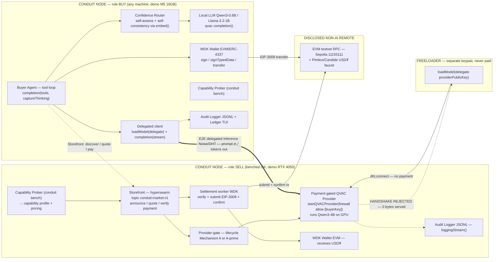
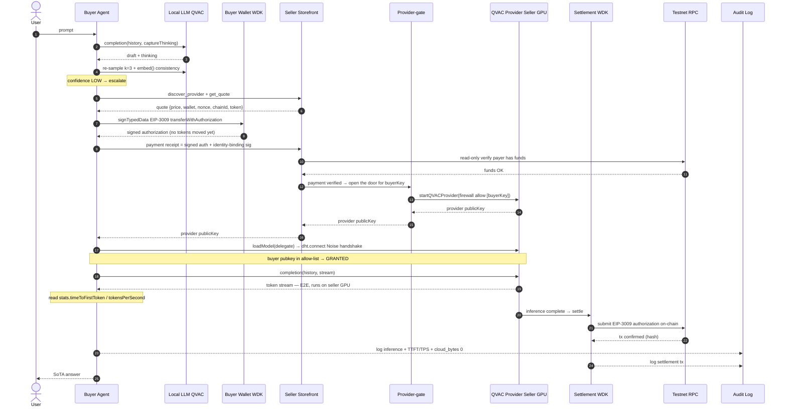
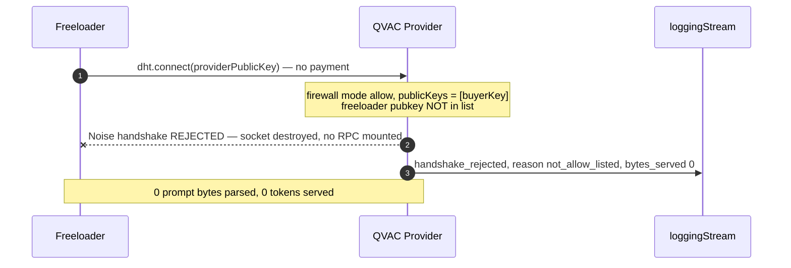
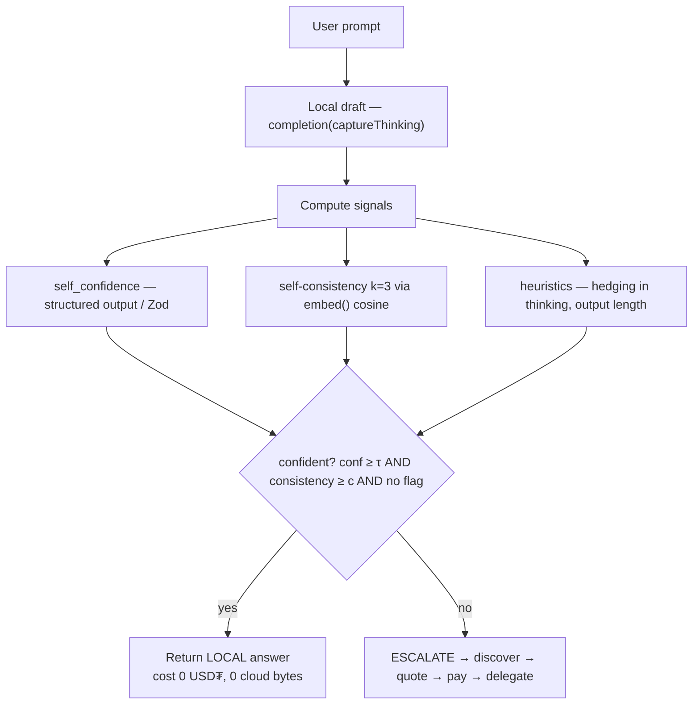
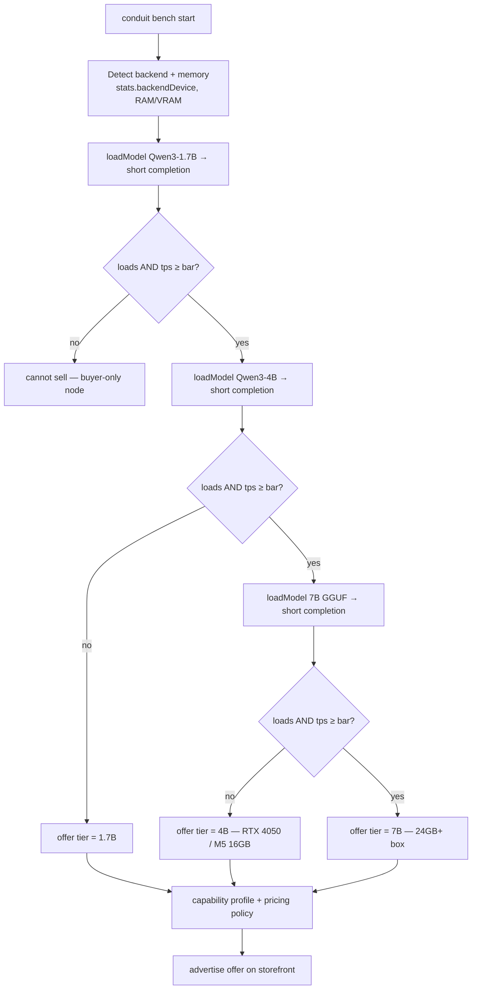
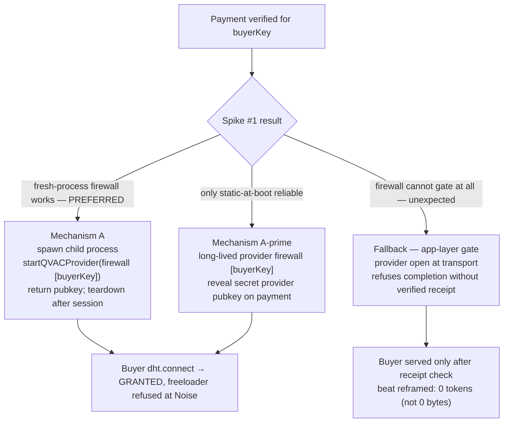
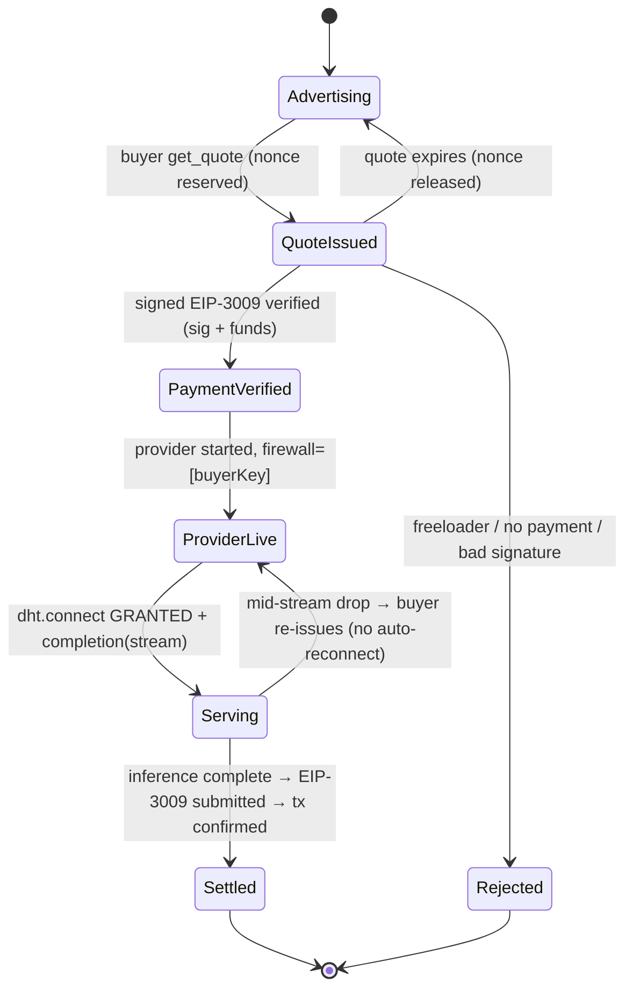
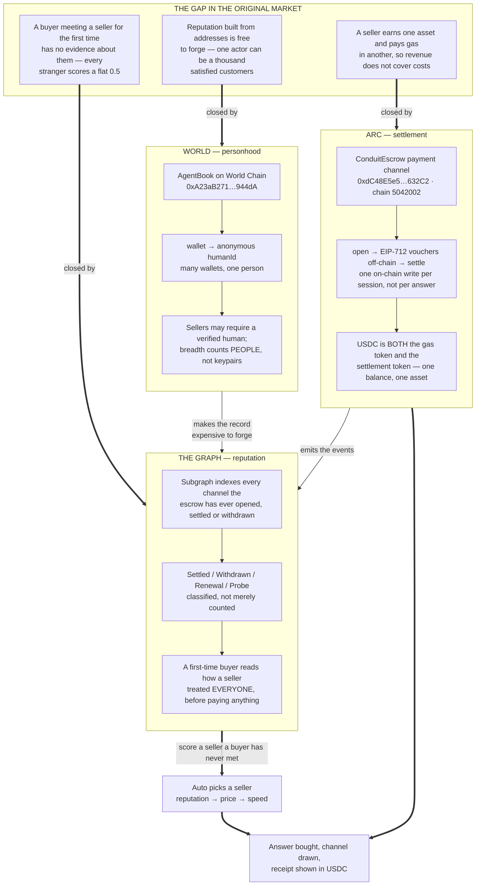

# CONDUIT — Architecture Diagrams (Mermaid)

> Companion to `CONDUIT-PLAN.md`. Every element is grounded in the verified v0.11.x QVAC + WDK docs. Markers: **[DOC]** = confirmed in docs · **[SPIKE]** = to be validated in Phase 0. Render in GitHub, VS Code (Mermaid extension), Obsidian, or https://mermaid.live.

**Legend — the three channels (this is the whole trick):**
- **Storefront channel** (our own `hyperswarm` topic) — discovery, quote, payment receipt, provider-pubkey handoff. Small JSON, *no prompt data*. (Built by us; not a QVAC primitive — delegation has no topic/discovery [DOC].)
- **Delegated-inference channel** (QVAC over Hyperswarm/Noise) — `prompt in / tokens out` only, E2E encrypted, runs on the seller's GPU [DOC].
- **Testnet RPC** (disclosed non-AI remote) — settlement tx only; *never* sees a prompt/model byte.

---

## 1. System architecture (component view)

*Both nodes are the **same `conduit` binary** with different role flags; the Capability Prober lets each machine decide what it can sell. The freeloader is a separate keypair/process, not a third machine.*

---

## 2. End-to-end happy path (the payment-is-the-grant flow)

*Settlement is **per completed inference** [locked]. The signed EIP-3009 authorization is a "signed intent, not a transfer" [DOC] — the seller only redeems it on-chain after serving.*

---

## 3. The freeloader rejection (the security beat)

*Refusal happens at the **transport/Noise layer** before any RPC is mounted [DOC]. [SPIKE #3] confirms we can observe the rejection cleanly via `loggingStream`.*

---

## 4. Confidence router decision (replaces the unavailable logprob signal)

*`completion` does **not** expose logprobs [DOC], so we measure **answer stability** instead. [SPIKE #4] validates separation on ~20 prompts.*

---

## 5. Capability Prober (`conduit bench`) — how a node learns what it can sell

*Real TTFT/TPS measured here and at serve-time land in the **same JSONL** → one-run artifact consistency.*

---

## 6. Payment → grant: the provider-lifecycle mechanism ([SPIKE #1] picks the branch)

*Why this exists: the QVAC firewall is **static at `startQVACProvider`** and the call is **idempotent** — there is **no runtime allow-list mutation** [DOC]. So we make payment *precede* the provider that admits the buyer, instead of hot-editing a running allow-list.*

---

## 7. Session lifecycle (state machine)

*`ProviderLive → Serving` is where the handshake is granted; `Rejected` is the freeloader path. "No auto-reconnect" and "provider restart breaks open connections" are documented v1 limitations [DOC].*

---

## 8. The Continuity layer (ETHOnline 2026)

The market above works, and settles, and refuses freeloaders. What it could not do was
help a buyer who had never met a seller before — a stranger scored a flat 0.5, so "Auto"
quietly degraded into price-then-speed. The obvious fix, counting settlements per address,
is worthless on its own: addresses are free, so a seller can be its own thousand happy
customers.

Three integrations close three different halves of that problem, and none of them is
sufficient alone.

*Arc is where value actually moves, and its one-asset model (USDC is both gas and
settlement) is what lets a seller's revenue cover a seller's costs. The Graph turns the
escrow's event log into a record a stranger can read before paying. World is what makes
that record expensive to forge — without it, the reputation layer would be a
sybil amplifier rather than a defence.*

---

### Diagram → plan-section map
| Diagram | Plan section |
|---|---|
| 1 System architecture | §3.1 |
| 2 Happy path | §2.1 + §2.2 + §3.3 |
| 3 Freeloader rejection | §2.3 + §5 |
| 4 Confidence router | §3.2 |
| 5 Capability Prober | §3.0 |
| 6 Payment→grant mechanism | §4.1 |
| 7 Session lifecycle | §2 + §4.4 |
| 8 Continuity layer (Arc / Graph / World) | ETHOnline 2026 |
